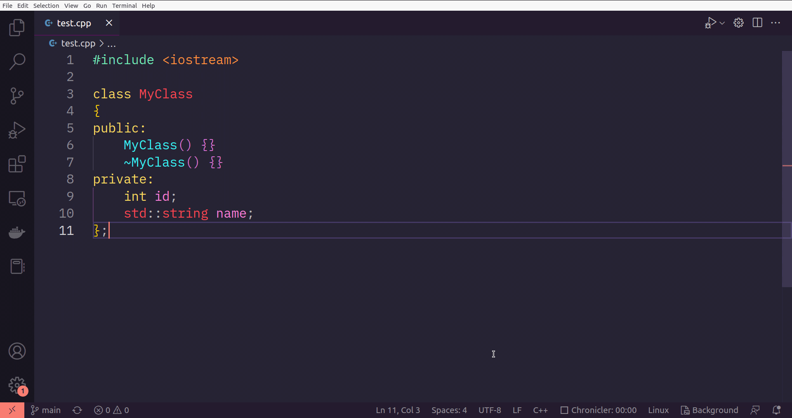

# Getter And Setter Generator For C++

1. Select your variable
2. `Ctrl`+`Shift`+`p`
3. Select `Generate Getter`, `Generate Setter` or `Generate Getter And Setter`
4. Generate getter/setter code to clipboard
5. Paste code! 

